# Analog Placement
---

## Design procedure
verify Design 階段用到最多的 tool，其他階段需要人工介入。

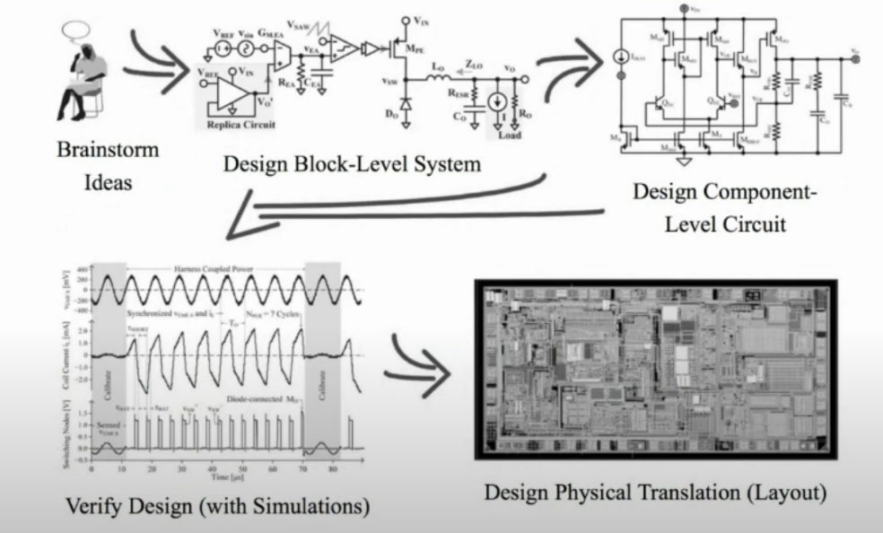

Rutenbar ISPD
數位設計有完整 EDA tool support,所以 Design Effor 小於類比設計
RTL design -> gate level -> pythical synthesis
類比設計 post syn 過了，還會看設計圖，繼續更改

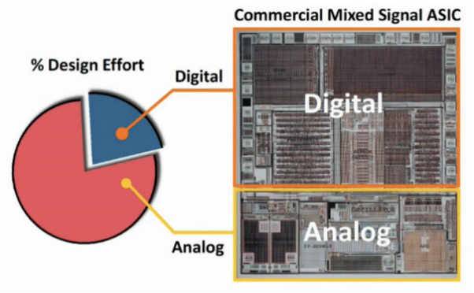

Layout migration: 有 reference layout ，大致相同，作為參考。
Layout synthesis by learning from design repository - AI 每個公司都有一堆以前做的 layout ,把資料拿去訓練

在做 layout generation , Retargeting 和 Layout Synthesis 之前，
分別會有不同的 input, 限制如 symmetry, template 或者 AI 學習 (模仿 layout engineer

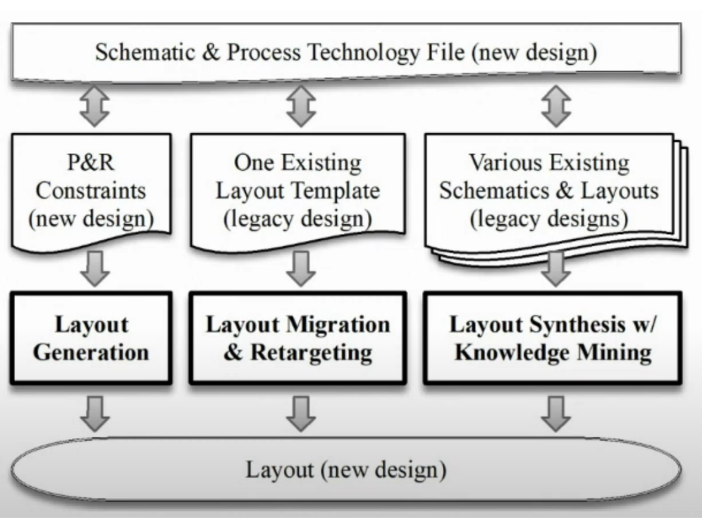

## Analog layout Migration
preprocess 一定有 reference 

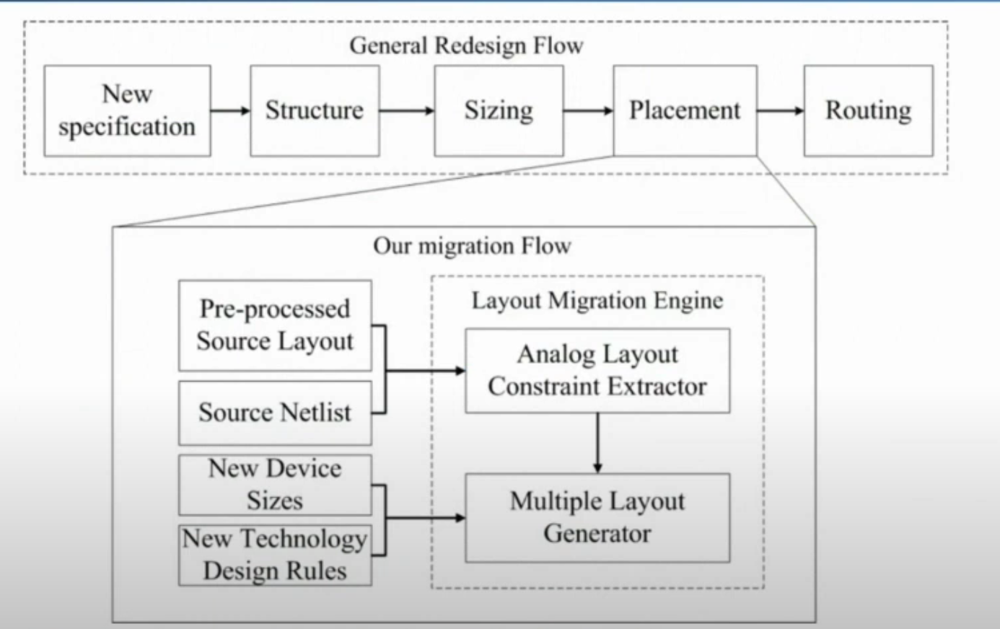

深層式 AI

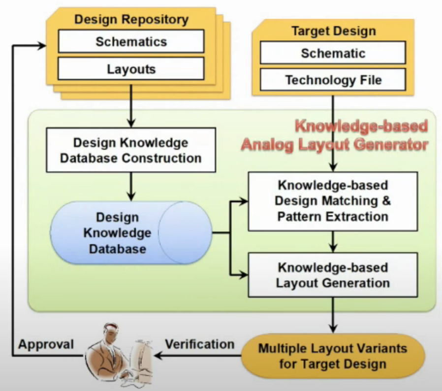

parametric instances = premitive cells = building blocks

---

## Placement Constraints

### symmetry
對稱

### symmetry-island
比 symmetry 更嚴謹
目的：減少 variance
placement緊緊貼在一起像一個 island

Pelgrom et al., JSSC'89

$\sigma^2(\Delta P=\frac{A_p^2}{WL}+S_p^2D_x^2$
$W,L$ - device size
$D_x$ - distance between two devices

製程變異，造成元件特性不同。與上面 func 所牽扯到的參數有關。晶片擺越近，越大，變異越小。W, L designer 決定的

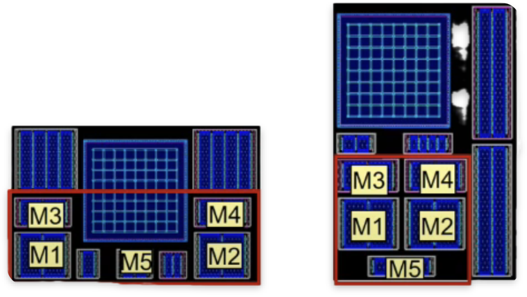

### Common Centroid

對中心點做對稱
出現在有倍數關係的電路內，像是 current mirror
目的：不受製程變異的影響，精確

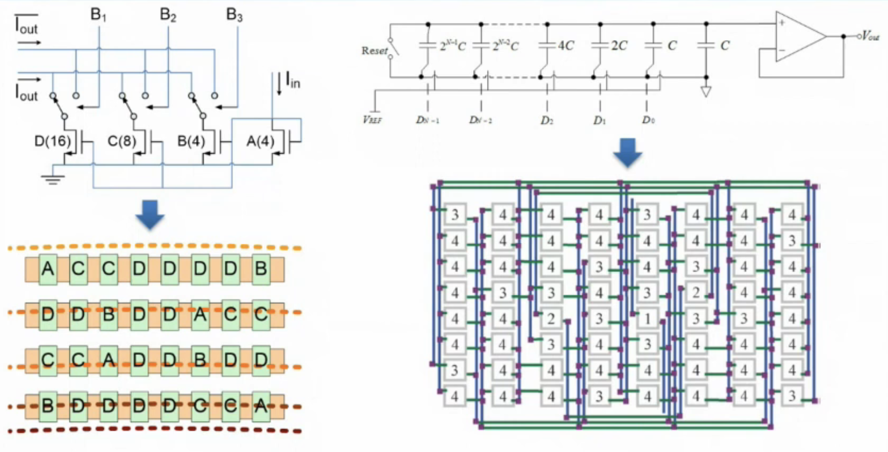

### Proximity Constraints (Well-island Constraints

pmos nmos 的 bulk 接角，接到的電位不同，相同 substrate 電位要擺在一起。才能用 guard ring 把他包起來。
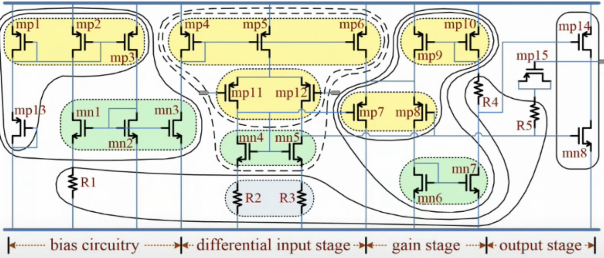

### Regularity

先進製程重要， FinFet
規則排列

### Boundary

子電路有 external connection，盡量擺在 boundary 上

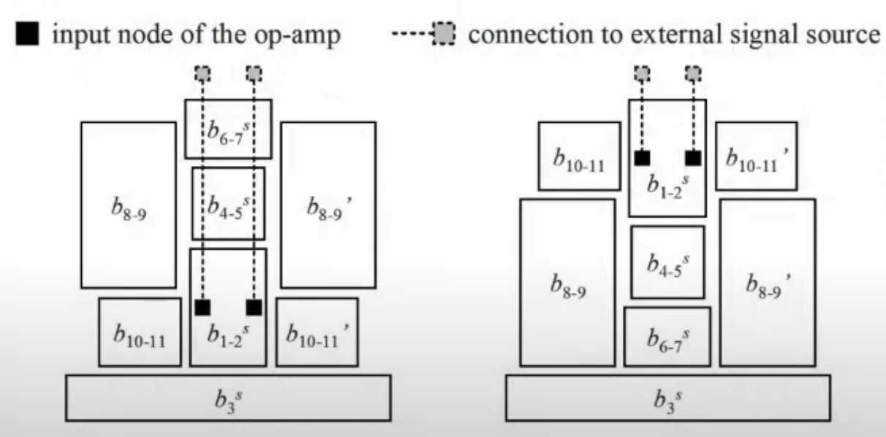
### Current path

$V_{DD}$ 到 $GND$ 有 current path
$V_{DD}$ 和 $GND$ 在上下左右不同側

以下圖為例，$V_{DD}$在左邊，$GND$在右邊，current path 橫向擺放
假設很假：每一個 block 高度相同...

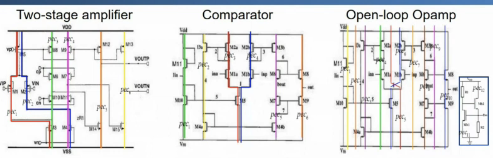
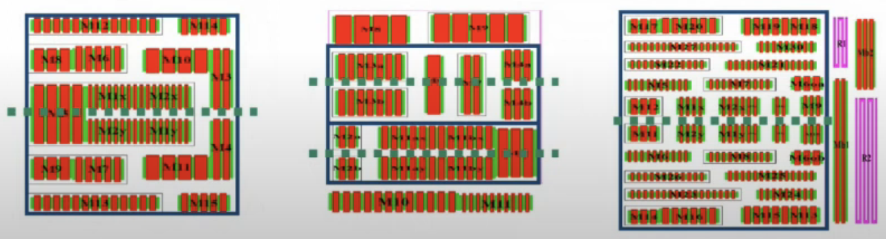

### Monotonic current path

可轉彎
優點：減少寄生電流

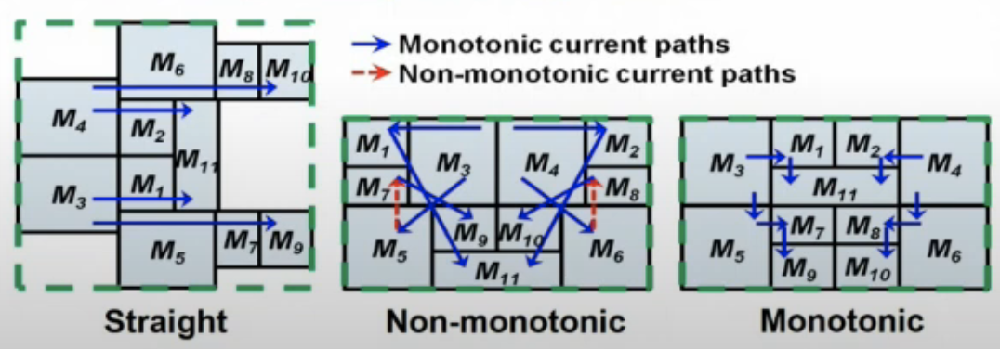

### Thermal Effect & Device Mismatch

電晶體電流隨溫度變化
高功耗, sensitive

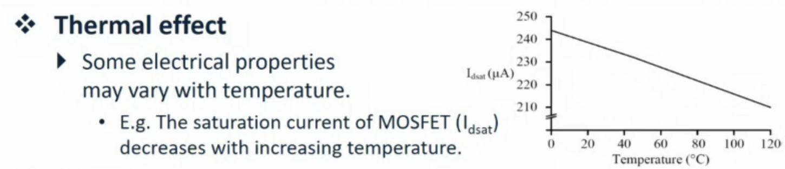

考慮發熱源，免得 mismatch

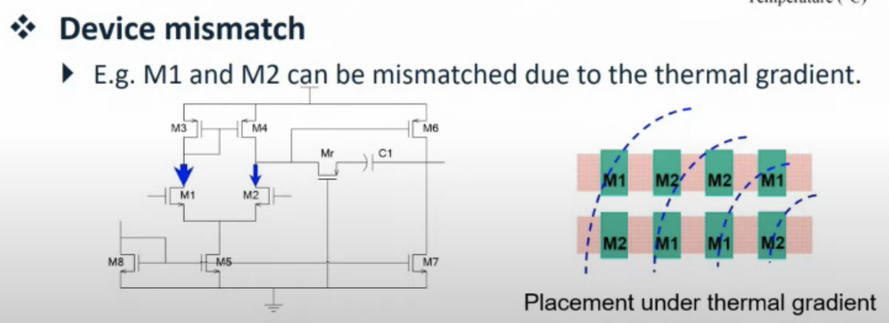
---

## Analog Placement Method Considering Symmetry Constraints

### 表示法？

==絕對座標==
不用這個
缺點：每次都要檢查有沒有 overlap
linear program formulation，把 constraints 寫進數學式子裡，好一點 $O(n^3$

==topological representation==
都用這個
相對位置表示法
不會有 overlap 問題

對當下 placement 打分數後，做 perturb，選擇最佳 placement

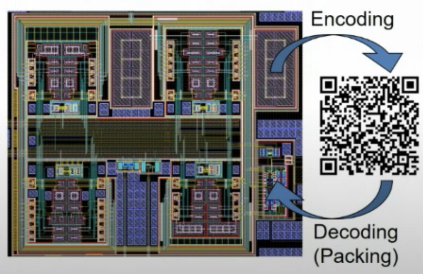

## Slicing Tree

non-slicing floorplan : 沒辦法垂直或水平找到切線
skew: node 和其 right child 的 label 不相同。已達到 1 vs 1 關係。

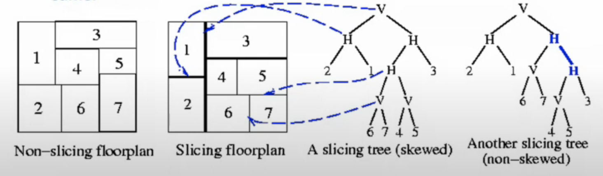

array -> tree -> graph

==polish expression==: 字串與 tree 有 1 vs 1 關係
做 Postorder traversal

left -> right -> node

An expression $E= e_1 e_2...e_{2n-1}$, where $e_i \in \{1,2,..., n, H, V\}$, $1≤i≤ 2n-1$, is a Polish expression of length $2n-1$ iff

1. every operand $j$, $1≤j≤n$, appears exactly once in $E$;
2. (==the balloting property==這個ㄕ擾動滿足條件 for every subexpression $E_i= e_1 ... e_i$ $1≤i≤2n-1$, # operands > # operators. (數字>HV

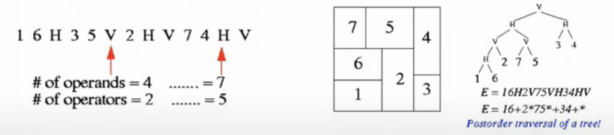

==Normalized polish expression==

unique

A Polish expression $E= e_1, e_2 ... e_{2n-1}$ is Called
normalized iff $E$ has no consecutive operators of thesame type ($H$ or $V$.

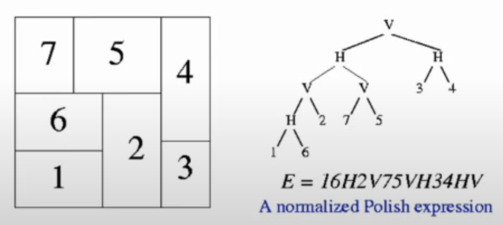

### Neighborhood Structure

擾動方式

## B*-Tree

往左往下壓

Tree root: 壓縮後 placement 最左下角的 block
binary tree

### B*-Tree Packing

有 tree 後 decoding 變成 placement
preorder triversal
parent -> left -> right

### Computing y-coordinates

從上往下看，看到的人用 doubly linked list 擺在一起

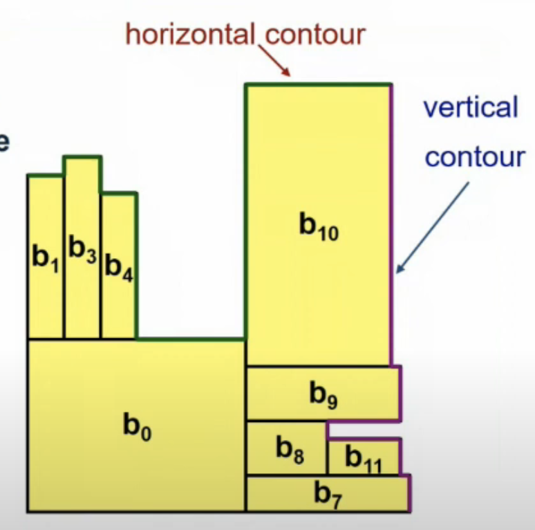

## Sequence pair (SP)

## Symmetric-Feasible B*-tree

如何找到滿足對稱條件

inorder triversal

left -> parent -> right

不好用

## Symmetry Island

小的 B*-Tree 打包，表示為 group 其中一半
形成 hierarchical 結構

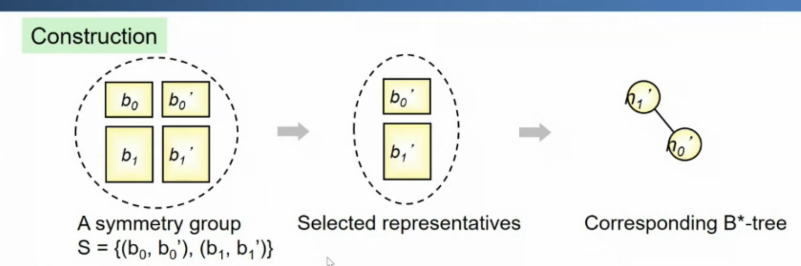
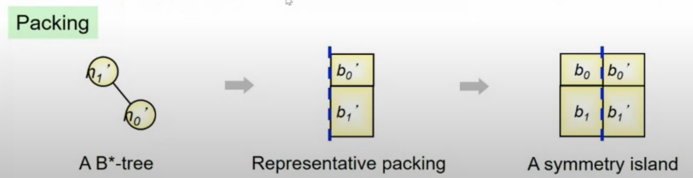

紀錄 contour

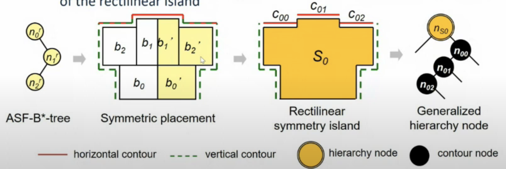
