# Floorplanning

chip planning 介紹

### partitioning

- areas and shapes can't be modified (rigid/hard block) = size
- approximate areas and no particular shapes (flexible/soft block) = $w \times h$
- now: partitioning according to functionality

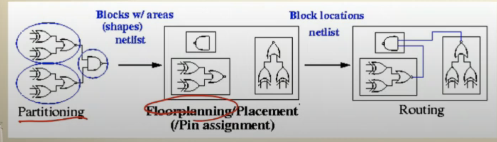

### floorplanning

- location
- shape, pin location
- based on functionality
- 2-D
- resources have been determined and estimating delay
- top down design strategy
- step-wise refinement strategy = initial solution + improve

### Objectives

- minimize total chip area
- reduce wirelength
- maximize routability
- minimize congestion (track)

$$
\rm{aspect\_ratio} = \frac{h_i}{w_i}
$$

### soft block

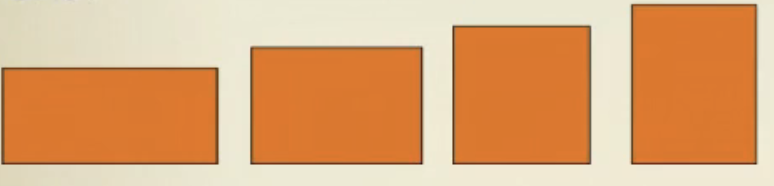

### hard block

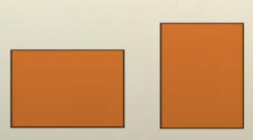

### Objective function

$$
Cost = \alpha A + \beta L
$$

decide by designer $\alpha , \beta$

A 是 area, B是 wirelength

A 影響比較大 $\mu m^2$ ,B 才 $nm$

floorplanning 還沒決定好 gate 要擺放的位置

希望估計 wirelength

- center-to-center estimation

- half-perimeter estimation
  
  2024Spring_EE6094_CAD_For_VLSIDesign_Chap7_Floorplanning (1) 32:09

Dead spcace

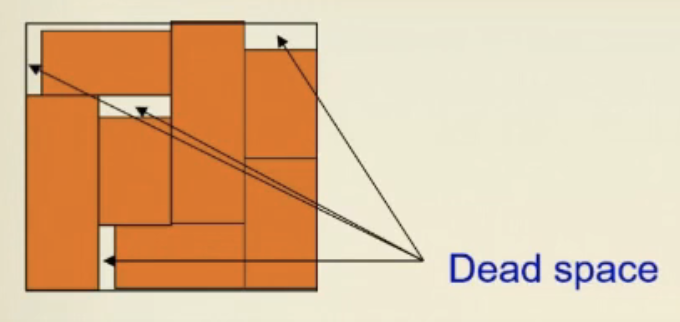

Dead percentage

$$
(A-\sum_i{A_i})/A\times 100
$$

### Slicing function

repetitively subdividing

vertical -> horizontal -> vertical

 

### Non-slicing function

not the completed cut

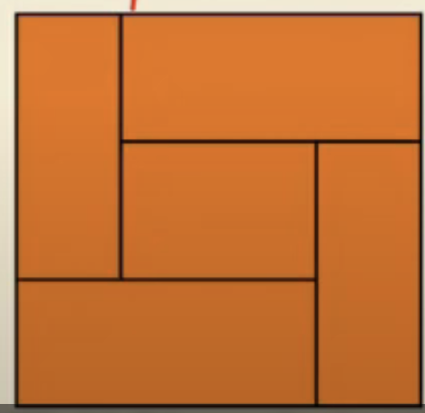

## Polar Graph Representation

- a pair of acyclic graphs : horizontal, vertical
  
  - Vertex: channel
  
  - Edge: 2 sides of block 

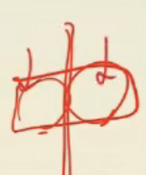

- vertex -> cut

- edge -> one block (上面有標示weight)

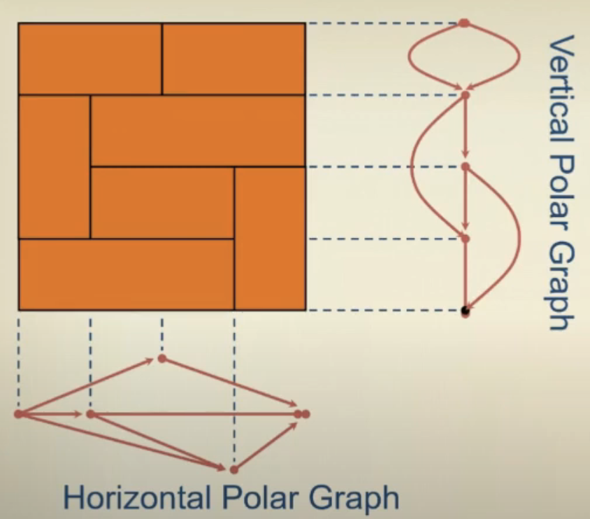

### Leaf cell

at the lowest level

it does not contain any other cell

### Composite cell

composed of leaf cells or composite cells

H is horizontal cut

V is vertical cut

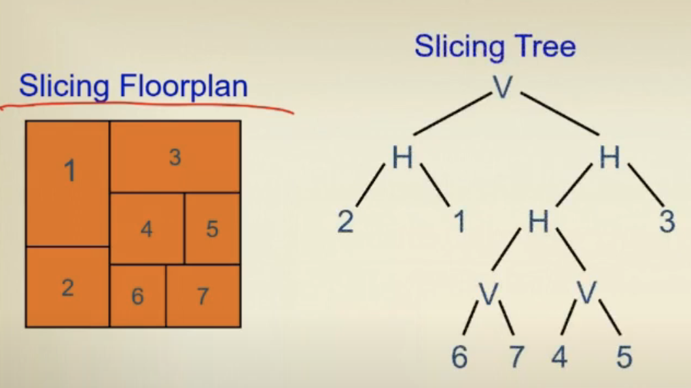

🟥 **Post order** = polish expression

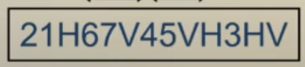

For $n$ blocks, a Polish Expression contains $n$ operands (blocks) and $n-1$ operators $(H,V)$

🟧 **Skewed Slicing Tree**

- $\rm{node}\neq \rm{right\ son}$

🟧 **Normalized Polish Expression**

- no consecutive H's or V's

(the balloting property)for every subexpression $E_i = e1, e_i$,

$1≤i≤2n-1$, # operands> # operators.

Chain: HVHVH ... or VHVHV ...

adjacent : 相臨 operands(num)或 operators(V,H)

⬛️ 

- M1 (Operand Swap): Swap two adjacent operands.

- M2 (Chain Invert): Complement some chain ($\overline{V}=H$, $\overline{H}=V$). 

- M3 (Operator/Operand Swap): Swap two adjacent operand and operator.

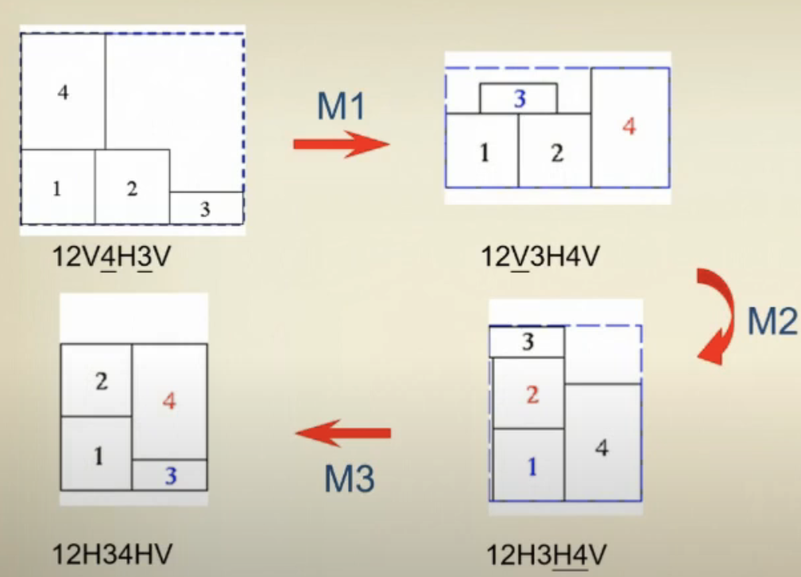

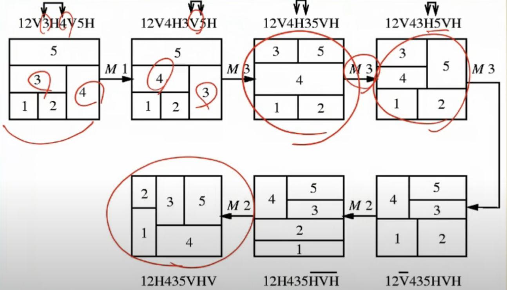

### Cost Function

$$
\phi =A+\lambda W
$$

A is bounding retangle

W is overall wiring length

$\lambda$ user-specified parameter

$$
W=\Sigma_{ij}c_{ij}d_{ij}
$$

$c_{ij}$ : # of connections between i and j blocks

$d_{ij}$ : center to center distance

- Soft block : continuous regions

- Block with several existing design

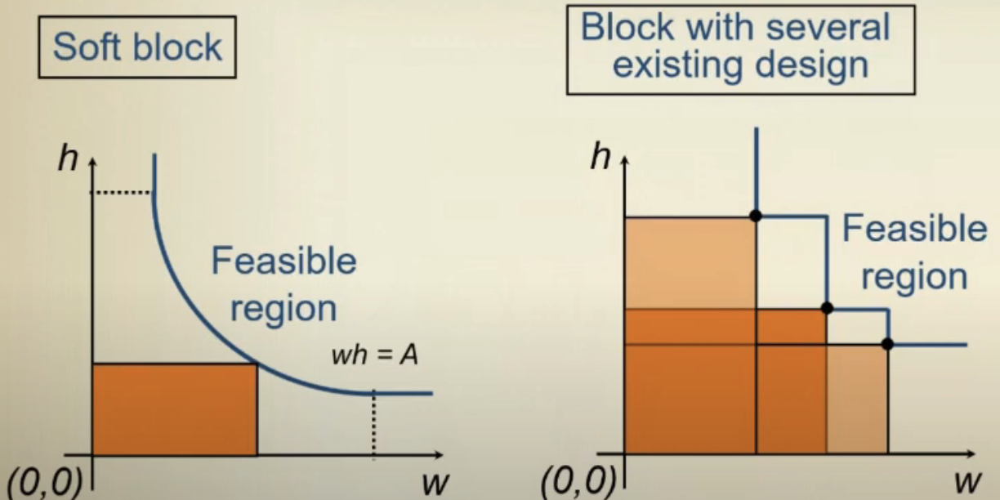

### Curve Combining

continuous 很難做

抽樣幾個可能性

同長 或 同寬 可以比較一下，刪掉大的

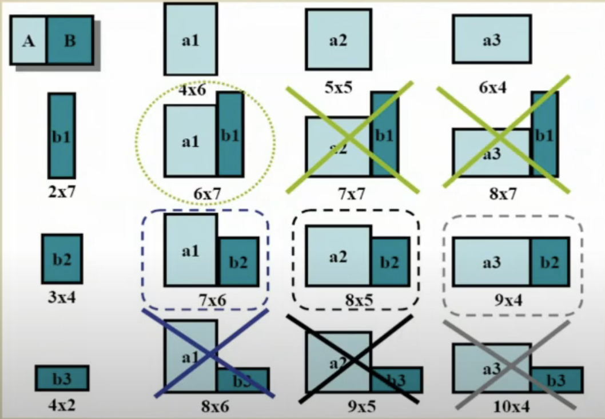

每個 node 留下相對好的解答 Dynamic programming!

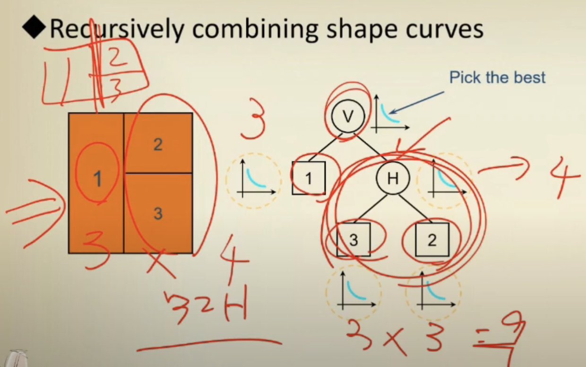

k points for each shape curve, for each NPE $O(kn)$

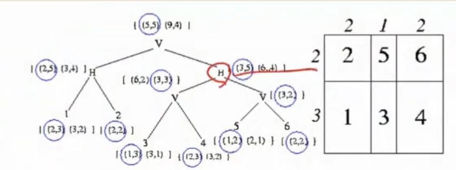

updating move: 只會動有變化的部分 (at most two path) $O(k \log n)$

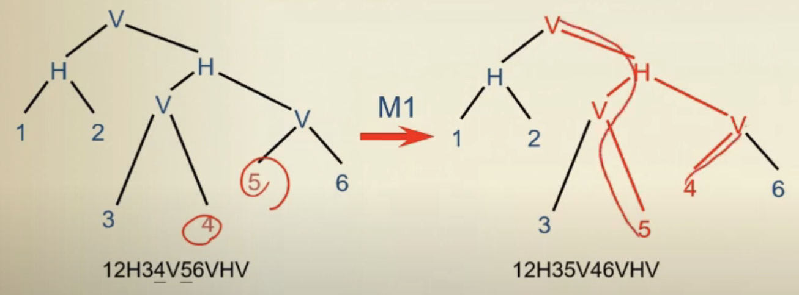

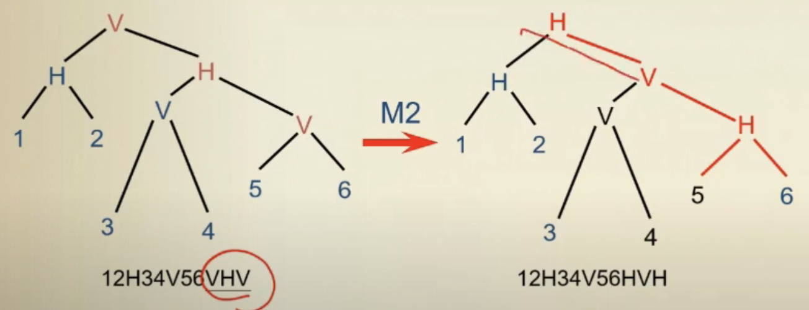

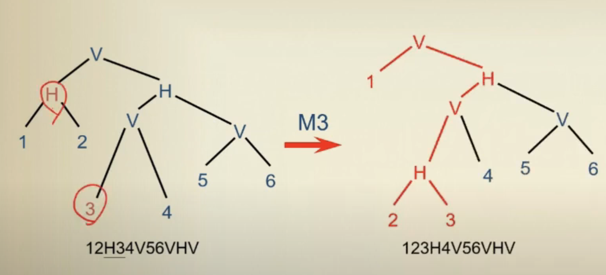

## Sequence Pair

不是  slicing floor plan 怎麼設計

Simulated Annealing

> ( 2024Spring_EE6094_CAD_For_VLSI_Design_Chap7_Floorplanning (2)53:05)

邊邊延伸

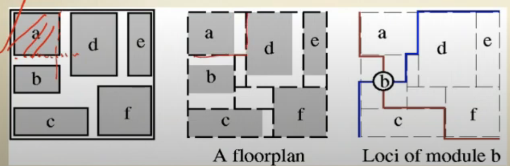

### Locus

從中心點開始，碰到邊線，觸發下面兩種，並畫圖

Postive loci: right-up, left-down 左上到右下切 $\Gamma_+$

Negative loci: up-left, down-right 左下到右上切  $\Gamma_-$

$x'$ is after (before) $x$ in both $\Gamma_+$ , and  $\Gamma_-\Rightarrow x'$  is right (left) to $x$.

$x'$ is after (before) $x$ in $\Gamma_+$ , and $\Gamma_-\Rightarrow x'$ is before (after) to $x$. $\Rightarrow x'$ is below(above) x

cf ( f 都在 c 的右邊)

ab(b在a後面，b在a前面。所以b在a下面)

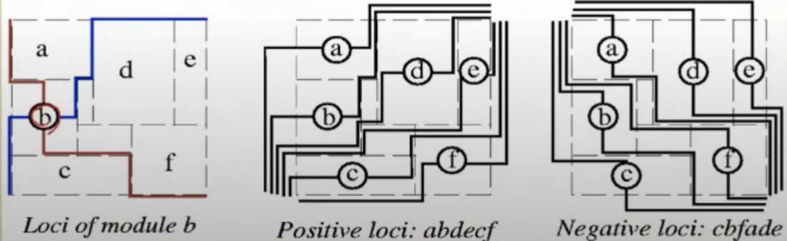

標好 $\Gamma_+$ 和 $\Gamma_-$ 畫格子，然後轉 45 度角

source node, terminal node

longest path algorithm 找到對應的 location

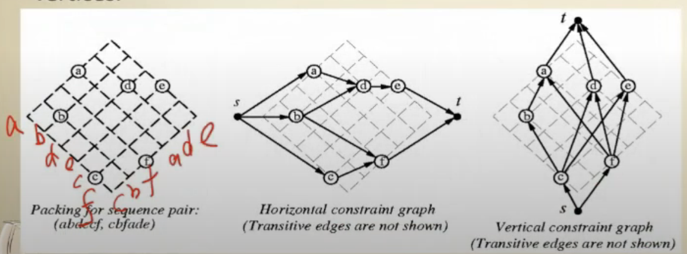

## B*-Tree

left child $\Rightarrow$ 右邊

right child $\Rightarrow$ 上面

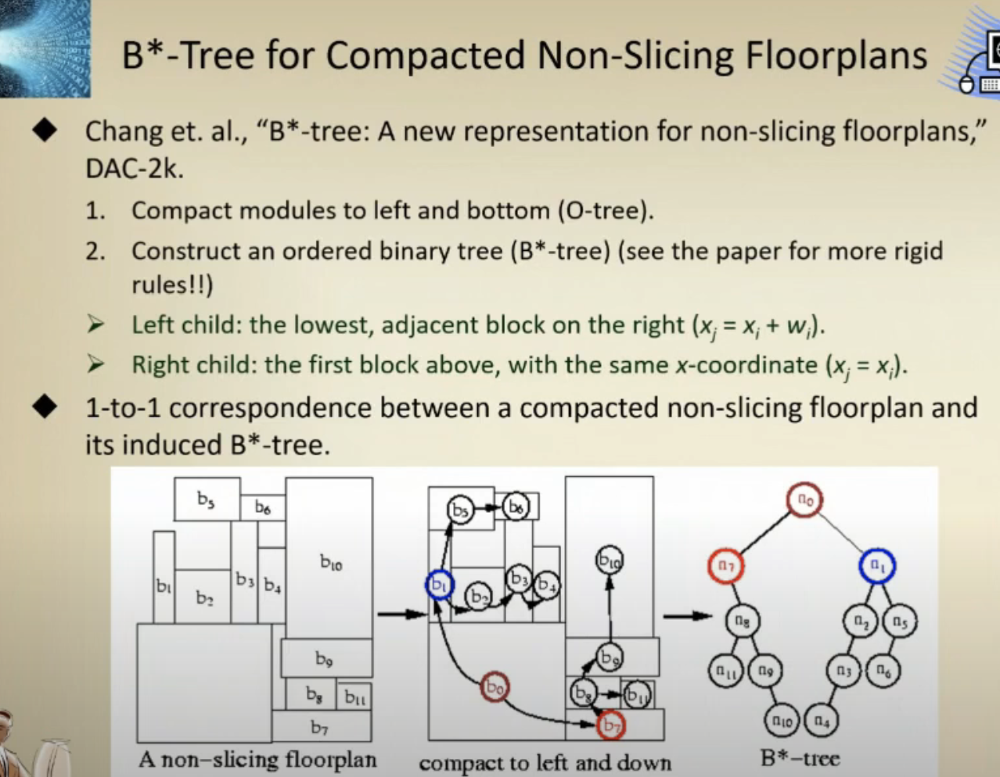

x coordinate: 

- Left child: the lowest, adjacent block on the right ($x_j=x_i+w_i$)

- Right child: the first block above, with the same x-coordinate ($x_j=x_i$).

y coordinate?

用 contour : 紀錄每一段 x 座標最高 y

可用 linked list

- x 左邊座標

- x 右邊座標

- y 高度

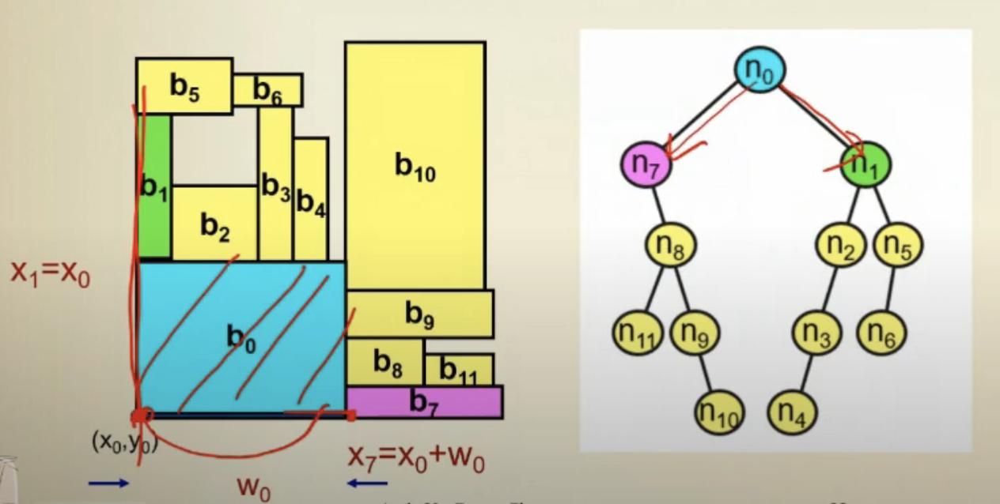

### Preplaced module

交換

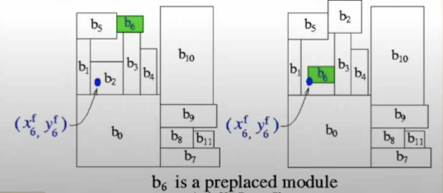

### 引用

> 🟧🟨🟩🟦🟪⬛️⬜️🟫🟥