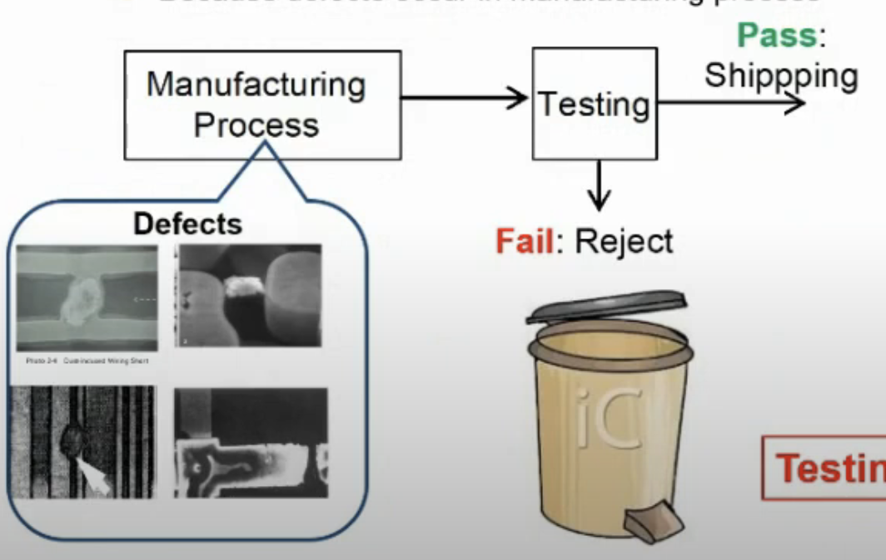
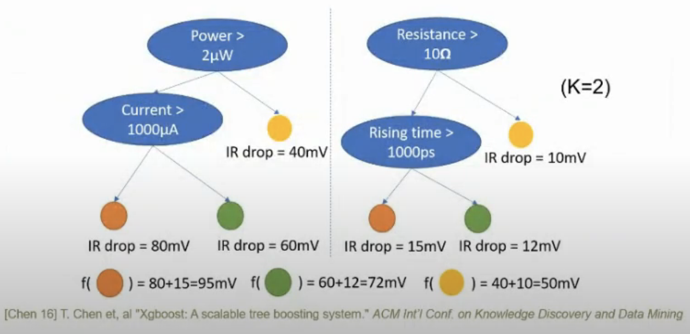
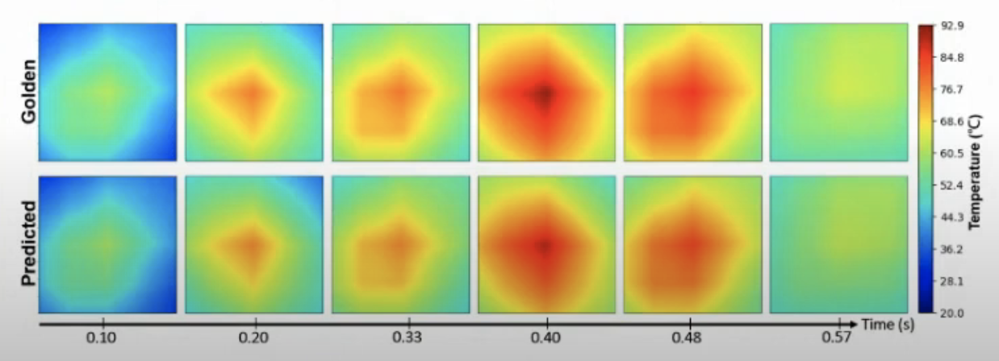

# Testing for AI AI for Testing

piece of hardware 測試 IC

- Test escape : under testing

- Yield loss : overskill, over-testing

答案是 A ，IC testing since it does not involve applying real signals to a physical IC.

## Why AI is Useful for Testing?

- decision making

- a lot of data

- very fast

- generating images

## IR Drop

over-testing

Test power is higher than normal power (因為需要在短時間內測試好)

## Traditional Solution: Modify Nodal Analysis (MNA)

超大矩陣有夠難算

## Traditional IR Drop Signoff Flow

需要 many  iterations , very slow

2018 年 5M cells -> 8 hr

紅色部分，要有好的 model 好的 features ，免得資料量太多。

## Regional Model

ECO Region

IR drop 嚴重的點，和 designer 重視的區間抽出來，減少面積（讓 model 比較好聚焦問題）

## Feature Extraction

自己本身和旁邊的人都很重要

- Target cell - power, physical, timing

- Neighbor cell - density

有幾個 features 很重要

- $P_{total}$ - total power

Switching power + Leakage power + Internal power

- TR - Toggle rate 

$$
Toggle rate = \dfrac{number\ of\ toggles}{number\ of\ clock\ cycles}
$$

- Cell type index

BUF, INV, AND

- Load capacitance

負載重 IR drop 也高

- $I_{peak}$ - Peak Current 

- $I_{avg}$ - current

- Physical location - XY coordinate 旁邊可能有很多個 cell 干擾？

- Path resistance (R) - The resistance from power bump to target instance

- Timing window - Max/min rising/falling time from STA report 這個 cell 在動，其他 cell 有沒有也在動 (互相干擾？)

- Neighbor Features

## XGBoost

decision tree 的 machine learning model

## Benchmarks

## Evaluate Metrics

- Normalized Root Mean Square Error (NRMSE)
  
  $$
  NRMSE = \dfrac{RMSE}{mean(\hat y)}\times{100\%}
  $$
  
  $$
  RMSE = \sqrt{\dfrac{\Sigma^N_{i=1}(\hat y_i-y_i)^2}{N}}
  $$

- Correlation coefficient (CC)
  
  $$
  CC = \dfrac{\Sigma^N_{i=1}[y_i-mean(y)][\hat y_i - mean(\hat y)]}
{\sqrt{\Sigma^{N}_{i=1}[y_i-mean(y)]^2\Sigma^{N}_{i=1}[\hat y_i-mean(\hat y)]^2}}
  $$

- Mean Absolute Error (MAE)
  
   高估低估都不好
  
  $$
  MAE = \dfrac{\Sigma^{N}_{i=1}|| \hat y_i -y_i||}{N}
  $$

- Max Error (MaxE) 

mV - larger 表示比較差

$$
MaxE = max(\hat y_i-y_i), i = 1\ to\ N
$$

## IR Drop prediction for Design 1

## IR Drop prediction for Design 2

Region 縮小，增加 prediction 準確率

Region model better than global model

## Precision & Recall

$$
Precision = \dfrac{True\ Positives}{True\ Positives + False\ Positives}
$$

$$
Recall=\dfrac{True\ Positives}{True\ Positives+False\ Negatives}
$$

## Similar result on Region 2 of Design 2

## Runtime Comparison

## Fault Models and Test Generation

- Fault model

- Test patterns

- Test Length

- ATPG (automatic test pattern generator) - random

A : 0

B : 1

C : X

## NVIDIA GPU Power Growth

## Motivation

- High test power cause $\color{red} Thermal\ Damage$ 

- large disk storage 存取 test pattern

- long runtime

## High-Speed, Low-Storage Power and Thermal Predictions for ATPG Test Patterns

## Key Results

## Test

cell type 加入後，效果沒那麼好

max_depth 變小 ， mae 下降 ，maxE 下就 CC 提升 ， NRMSE 下降

## IR Drop Map

- Hotspots ，IR drop 嚴重的區域

- Vectorless 沒有 input vectors

- Vector-based 有 input vectors

## How to Fix IR Drop Hotspots?

- Engineering Change Order (ECO)
  
  - cell move
  
  - cell downsizing (gates 變小)
  
  - add decouping capacitors (電容變多)

# Boosting

針對 misclassified cases ，weight提升

## Types of Boosting

- Adaptive boosting (AdaBoost)

給所有 elements 一樣的 weights

Misclassified 就給比較高的 weights

Error 小到一個 threshold 停止

- Gradient boosting (GB)

用 gradient descend 方式

- Extreme Gradient Boosting (XGBoost) 

Gradient descent

Parallel processing

Regularizatoin: 降低 overfitting
