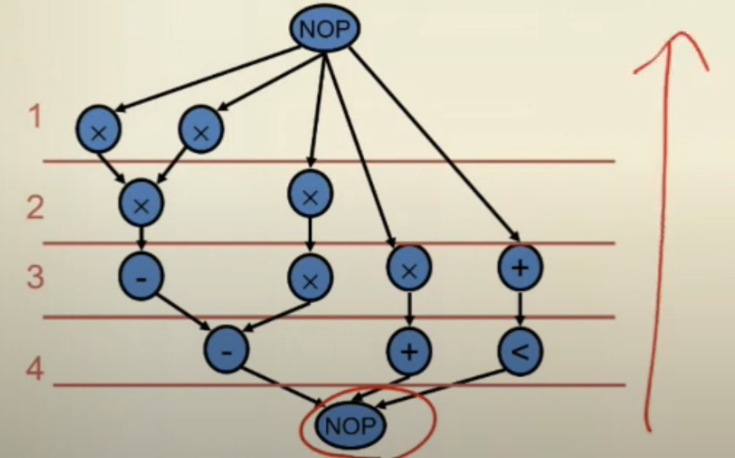

# Scheduling and Binding

## ASAP

scheduled by predecessors 祖先做完空蕩蕩的，就馬上去下一件事

overhead 問題 (第一個 stage 有四個乘)

```
Schedule Vo at to=0
While （Vn not scheduled）
    Select Vi with all scheduled predecessors 
    Schedule Vi at ti = max{tj+dj}, Vj being a predecessor of Vi
Return tn
```

嘗試不要有拖延症


## ALAP (Latency  Constrained)

```
Schedule Vo at tn=lambda+1
While （Vn not scheduled）
    Select Vi with all scheduled successors 
    Schedule Vi at ti = min{tj-dj}, Vj being a successor of Vi
Return tn
```

嘗試把事情越拖延越好



## Mobility

ASAP 和 ALAP 針對每個 cell 會各有一個時間點，在這先時間點範圍內都可以擺放這個 cell，此為該 cell 的流動性。

## Hu's Algorithm

跟 sop 距離，決定要處理的元件 (longest critical path) 

- cons
  
  - one type of operation
  
  - can't not handle different delay


## List Scheduling

定義 hardware limitation

- 看 label (critical path)

- 多種 operation 分開看


### List scheduling - MR-LCS

minimum resource latency constraint

每一個 stage 使用最少 resource 已達到符合條件的 latency constraint


## Force-Directed Scheduling

mobility

$$
\mu_i = t_i^L-t_i^S
$$

V6 可以被放在 stage 1 and stage 2

- Operation-type distribution (Not normalized to 1)

$$
q_k(l)=\Sigma_{i:T(v_i)=k}p_i(l)
$$


## 

1. (a) 不會只提供一個 solution， hardware 只有兩個，有三個 operation 準備好了，任意取兩個，所以有很多組解。這個找得到 optimal solution，因為有 limitation 在裡面，把原來複雜的問題化簡了，polynomial time solution。確保 critical path 先擺。

2. - one operation
   
   - unit delay
     
     把 NP 問題轉成 P 問題

```
struct node{
    int node_name;
    int label;
    int stage; // scheduling 完結果
    node* next_ptr;
}
```


